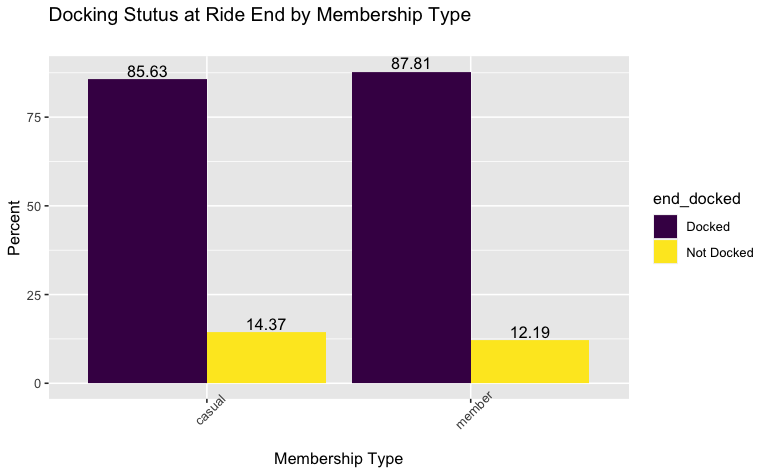

# Google Data Analytics Certificate Capstone

***

## Cyclistic Bike-Share Case Study: How does a Bike-Share Navigate Speedy Success

***

## Business Task

*How do Cyclistic annual members and casual riders differ in their use of the bike-share program? After understanding these differences, what recommendations can be made to encourage the conversion of casual riders to purchase memberships?*

Parameters for the research project can be found [*here*](assets/guidelines.pdf).

***

## Background and Executive Summary

This project employs 12 months of data drawn from Cyclistic's [*data repository*](https://divvy-tripdata.s3.amazonaws.com/index.html). The goal was to understand member and casual rider usage and find ways to encourage casual riders to purchase memberships since members provide the bulk of Cyclistic's profits.

***

### Data

The data for this project was drawn from Cyclistic's [*data repository*](https://divvy-tripdata.s3.amazonaws.com/index.html) under this [*license*](https://www.divvybikes.com/data-license-agreement) and was restricted to all 12 months of data for the calendar year of 2021. In total, 12 data files - one for each month - were downloaded. In total, 5,595,063 rows or observations were merged into one final data-set.

Files included:

- 202101-divvy-tripdata.csv
- 202102-divvy-tripdata.csv
- 202103-divvy-tripdata.csv
- 202104-divvy-tripdata.csv
- 202105-divvy-tripdata.csv
- 202106-divvy-tripdata.csv
- 202107-divvy-tripdata.csv
- 202108-divvy-tripdata.csv
- 202109-divvy-tripdata.csv
- 202110-divvy-tripdata.csv
- 202111-divvy-tripdata.csv
- 202112-divvy-tripdata.csv

*Important: The above and merged files exceed Git Hubs file size limitation. Therefore, in order to replicate this study, the files must be downloaded and placed in a folder nested one level below the location of the [*Scripts_Final.Rmd*](Scripts_Final.Rmd) code file. After the data files are downloaded, the program can be run and will create a final, cleaned file for analyses.*
  

#### Tools

R and its many packages were used to import, merge, clean, analyze and visualize the data. Packages included:

- readr
- tidyverse
- tidyr
- dplyr
- lubridate
- skimr
- janitor
- readxl
- EnvStats
- gmodels
- viridis

  

#### Cleaning

During examination of the data, cleaning and restructuring was necessary for analyses. Cleaning and restructuring steps included:

- Removal of duplicates
    - No duplicates were found, however, the step was still programmed in case the code is recycled for future analyses.
- Keep only relevant columns
    - Columns removed include: 
        - file_name which is what file the observation belong prior to the merging all 12 data sets.
        - ride_id which is the unique identifier for each ride.
- Identification of 'incomplete' cases as noted by cell values of NA
    - These cases are not true incompletes and are, instead, cases which were not docked at a station (at ride start or end). The start_station_name, start_station_id, end_station_name, and end_station_id cell values are NA for such cases. This is a part of the Cyclistic bike share program where bikes do not need to be docked and can be left at any location. A total of 1,006,761 rides are instances where the bike either began or completed its journey with no docking station.

  

#### Variable Creation

Several variables were created for future analyses and also to inform additional understanding and cleaning of the data. Variable creation included: 

- duration_min: calculation of ride duration in minutes was found by subtracting the started_at variable from the ended at variable.
    - The format of this variable was necessary to use for future analysis. Therefore, this variable was converted to a numeric format.
- weekday: the day week that the ride commenced which was created by applying the wday function to the started_at variable.
- month: the month of the year that the ride commenced which was created by applying the month function to the started_at variable.
- start_docked: a binary variable indicating whether the bike was Docked or Not Docked at the start of the ride
- end_docked: a binary variable indicating whether the bike was Docked or Not Docked at the end of the ride
- am_pm: a binary variable indicating whether the ride commenced in the AM (between 12:00 AM and 11:59 AM) or PM (12:00 PM and 11:59 PM)

  

#### Additional Cleaning Based on Newly Created Variables

After creation of the above mentioned variables, additional cleaning was conducted.

The range of duration_min was examined and and had duration times ranging from -118.0333 minutes to 55944.15 minutes. It is unclear how negative values occurred since this means the ride ending time preceded the ride start time. Such negative values were removed and resulted in a data set with 5,594,916 rows or observations. This removed a total of 147 cases from the initial number of 5,595,063 cases.

The longest ride was 550944 minutes or just under 39 days. Due to this very high number, there were concerns over the legitimacy of these ride times therefore, Rosner's test to find outliers was applied to the duration variable. The test indicated that a large number of the extremely long rides were outliers. Due to the results of this test and major concerns that such outliers would skew results, any rides over 24 hours were removed. Even with the removal of these cases, outliers were still indicated within the 0 to 24 hour range. The decision was made to not remove these cases, however, due to concerns over removing too many legitimate cases. After the removal of the 4,176 cases described above, 5,590,887 rows or observations comprised the final data set.

Upon completion of data cleaning and processing, a data set was saved and exported for future use.

***

### Analysis

#### Variables

The final list of variables and their categories include:

| Variable            | Description | Categories |
|---------------------|-----------------|-----------------|
| member_casual       | rider's membership status | member, casual |
| rideable_type       | type of bicycle used  | classic_bike, docked_bike, electric_bike |
| weekday             | day of the week the ride commenced | Monday, Tuesday, Wednesday, Thursday, Friday, Saturday, Sunday |
| month               | month of the year the ride commenced | January, February, March, April, May, June, July, August, September, October, November, December |
| start_docked        | docking status at time of ride commencement | Docked, Not Docked |
| end_docked          | docking status at time or ride completion | Docked, Not Docked |
| am_pm               | time of day at ride commencement | AM, PM |

#### Initial Exploration

Univariate analyses were the first step in fully understanding the data. Bar plots were created the number of rides for membership type, bicycle type, day of the week, month, docking status at the start and end of the ride and AM or PM ride start time.

Descriptive bar graphs below highlight the variables of interest that will later be examined by group or membership status. Findings are highlighted below.

  

**1. The majority of rides are taken by members.**

  

**2. Most rides are taken using docked bikes.** 

  

**3. Most rides are taken on Saturday followed by Sunday and then Friday.**

  

**4. Ridership is low in the beginning of the year but then steadily rises and peaks in July. After July, ridership steadily declines into December.**

  

**5. The vast majority of rides begin with bikes found at docking stations.**

  

**6. Similarly, the vast majority of rides end with bikes being docked at a station.**

  

**7. The majority of rides begin between 12:00 pm and 11:59 pm.**

  

#### Bivariate Descriptive Analysis

  

**1. Regarding duration, casual riders have a more than double mean ride duration than members - 26.87 minutes versus 13.4 minutes, respectively.**

  

**2. Roughly comparable percents for bicycle type are found members and casual users when it comes to electric bicycles. Of note, however, is the "docked bike" appearing only for casual users. It is not clear how this is unique as research into the data did not fully explain how this is different from electric and classic or non electric bicycles. Further examination is warranted of this category.** 

  

**3. For members, the percent of all rides is roughly consistent across the week. Any variation is found in the mid-week where ridership slightly peaks on Wednesday and then slowly declines into the weekend with the lowest percentage of rides on Sunday. For casual riders, however, ridership sees a slight increase on Friday and then a sudden surge on Saturday with a slight decline into Sunday. Ridership for casual riders remains mostly consistent across Monday through Thursday.**

  

**4. Ridership across months follows similar trends for both groups with percent of rides for each group being lower in the colder months. Of note, Cyclistic is in Chicago which has dramatic shifts in weather across the year. Members, however, see a smoother increase and decrease in ridership even as the weather warms, peaks and then cools in the fall. For members, ridership remains roughly consistent across early summer (June) and into mid fall (October). Casual riders see dramatic increases from April to May to June with ridership peaking in July with dramatic drops from September to October to November.**

  

**5. Membership status does not appear to be influential on whether the ride began with a docked or undocked bicycle. Very similar percentages for each group are found for those beginning with an undocked bicycle (87.42 percent for casual and 87.83 percent for members).**

  

**6. Similar to the docking status at ride start, docking status at ride end was not dramatically different for members and casual riders. 87.81 of all rides taken by members ended with the bike being docked while casual riders logged 85.63 percent of all rides ended at a docking station.**

  

**7. Time of day in which rides begin is slightly different for member and casual riders with members taking more rides in the morning. Specifically, 30.43 percent of all rides taken by members begin between the morning or between the hours of 12:00 am and 11:59 am. Casual riders' percentage of rides clocks in at 24.04 percent of all rides beginning in the morning - a difference of about six percent.**

***

## Conclusions

Focusing on the bi-variate analyses, differences between rider activity between members and casual riders are found. Within their group, casual riders take more rides in the afternoon and evening, have higher usage during late spring and summer, use the bicycles more during Friday, Saturday and Sunday, and have a longer mean ride duration.

Interestingly, members and casual riders do not differ dramatically in several factors such as type of bicycle used (assuming docked and classic bikes are the same as classic bikes must be docked) when whether they start or end the ride with a docked bicycle.

***

## Recommendations

- Offer seasonal memberships. Since casual riders have a greater percentage of rides during the warmer months of summer and early fall, it may be worthwhile to explore a shorter term membership option. Or, more specifically, allow riders to cancel at any time or choose the months they'd use the plan and not have to pay for the unused months. Of note, there may be little incentive for users to subscribe for an entire year so riders could be offered a small discount for paying upfront instead of month to month.
- Offer weekend only memberships. Since casual riders use bikes at a greater rate on Fridays, Saturdays and Sundays a weekend only plan could entice these riders to purchase subscriptions.
- Offer annual membership at a lower cost than the traditional membership but with some restrictions.
    - The restricted membership could include ride lengths similar to the traditional annual membership but could cap the rides per week the rider could take.
    - Additionally, a discounted annual membership could be a combination of the traditional annual membership and the casual ride per-minute use. Perhaps a discounted annual membership with a lower fee for per minute usage could be implemented.
    
***

## Next Steps

Based on this initial research, I would suggest a deeper dive into the data with more details and perhaps a multivariate analyses and the inclusion of outside data. Specifically:

- Bring in data about public transportation including buses and trains. Train data should include both light rail within the city of Chicago and the suburban commuter trains that reach far-flung suburbs. How are bus and train stops with the city arranged in proximity to the bicycle stations? How does the timing of public transport pick-ups and drop-offs impact usage across the day? If the flow of people within the city can be better understood, we can get a more complete picture of ridership.
- Bring in weather data including temperature and precipitation. While Cyclistic cannot control the weather, perhaps cold or wet weather gear can be suggested or such gear and other safety features can be added to the bicycles to allow for safe, comfortable riding in multiple types of weather.

